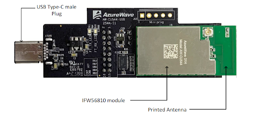
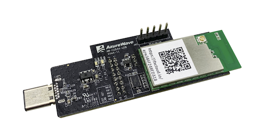
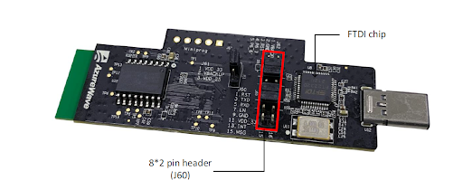
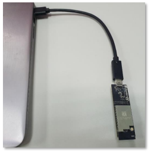
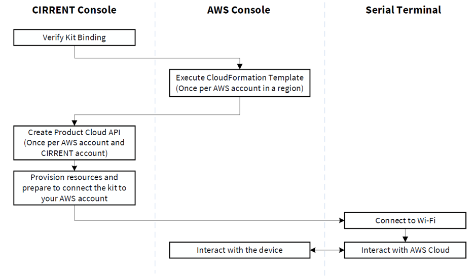

Getting Started With the CCM Development Kit
==============================================

Overview
**************

(testing publishing) INFINEON offers a CCM development kit containing a single AIROC™ CCM module which you can connect to any PC. It is designed to help you walk through the main capabilities of the CCM product, including:

* CIRRENT™ Cloud ID for effortless, secure cloud authentication using the device certificate pre-programmed into the CCM module
* Wi-Fi onboarding with additional assistance from the CIRRENT™ mobile app for testing, and a mobile app SDK which simplifies development of your own app
* Secure and reliable full network stack, including Wi-Fi, TCP/IP, HTTP, MQTT, TLS, and other networking features
* The ability to send secure and reliable Over-The-Air (OTA) firmware updates for CCM firmware
* Optional use of CIRRENT™ IoT Network Intelligence (INI) for monitoring and managing your CCM fleet and monitoring connectivity reliability
* Robust AT command set compatible with AWS IoT ExpressLink, making it easy to connect your host to the cloud

This getting started section walks you through: 

1. :ref:`Steps required to bind your CCM developer kit to an INFINEON Account for access to CIRRENT™ Cloud ID <Getting the CCM Bound to your Infineon Accounts>`

2. :ref:`Steps to get your CCM developer kit online <Getting the CCM Online>`

3. :ref:`Getting your CCM developer kit connected to your AWS account <Getting the CCM Connected to Your AWS Account>`

Kit Contents
**************

The IFW956810 CCM evaluation kit consists of an IFW56810 single-band Wi-Fi 4 Cloud Connectivity Manager module with powerful processing capability, a PCB antenna, an FTDI chip for the USB to serial interface, and an 8x2 pin header.

.. _Getting the CCM Bound to your Infineon Accounts:

Bind your CCM developer kit to your CIRRENT™ Cloud ID account
*************************************************************

CIRRENT™ Cloud ID provides the secure cloud-based device authentication that helps you to give your products secure and effortless access to your Product Cloud. This process works based on a unique device certificate embedded into every CCM module. These device certificates are pre-populated in CIRRENT™ Cloud ID. To get started with your developer kit you first need to bind your CCM developer kit to your CIRRENT™ Cloud ID account, which confirms ownership of the device.

.. note:: CIRRENT™ Cloud ID is an INFINEON service and you access Cloud ID using your INFINEON account. If you do not already have an INFINEON account, you need to register one first. Follow the instructions here.

Binding your CCM developer kit to a Cloud ID account is simple. The unique device ID is embedded in the QR code printed on your developer kit module. Simply scan the QR code located on the module, or use your browser and retype the URL printed below the QR code. 

The QR code will redirect you to the INFINEON website. If  if you already have a CIRRENT™ Cloud ID account, you can simply select the Cloud ID account you want to bind your developer kit to. Alternatively, click Create Account to create a new CIRRENT™ account.

.. note:: You can use the CCM development kit independent of an INFINEON Account and independent of CIRRENT™ services by pulling the Device Certificate from your device directly using an AT command, and manually provisioning your device in your cloud using that certificate.

You can `learn more about CIRRENT™ accounts here <https://documentation.infineon.com/html/cirrent-support-documentation/en/latest/cirrent-console.html#cirrent-console-user-architecture>`_ , and you can `learn more about Cloud ID here <https://documentation.infineon.com/html/cirrent-support-documentation/en/latest/cirrent-could-id.html>`_ .  

.. _Getting the CCM Online:

Getting the CCM module online
***************************** 

Connect the CCM module to your PC
^^^^^^^^^^^^^^^^^^^^^^^^^^^^^^^^^^^

The PC can be used as a host for evaluation. AT commands can be sent through a serial terminal on the PC to the IFW956810 CCM kit. 

Before you connect the CCM module to your PC ensure that pin 3 to pin 4, pin 5 to pin 6, pin 9 to pin 10 and pin 11 to pin 12 of header J60 are closed as shown in the figure below. J61 must be connected in position 1 and 2.

Connect the IFW956810 Single-band Wi-Fi 4 Cloud Connectivity Manager evaluation kit to your PC using either the Type-C connector or Type-A male to Type-C female cable.

Run a serial terminal to communicate with the kit over USB by choosing the higher of the two enumerated COM ports with the following configuration:

================   ===========================
Baud rate:         115200
Bits               8
Parity             None
Stop               1
Flow control       None
Local Echo         Yes
End of Line        Line Feed
================   ===========================

If you’re not sure how to connect to your CCM developer kit using a serial terminal you can view the  Setting up a serial terminal on your PC section for more details. 
Once you open the serial terminal, type 

:: 

	AT+CONF? About 

in the serial terminal.  You should see a response 

::

	OK Infineon IFW56810 CCM

Connect the CCM module to Wi-Fi
^^^^^^^^^^^^^^^^^^^^^^^^^^^^^^^^^

The CCM module has a built-in Wi-Fi onboarding process that works over Bluetooth® LE or SoftAP and which relies on an app available in the Android and iOS app stores. You can use this app to connect your CCM module to your Wi-Fi network.  

First,  download and install the CIRRENT™  Wi-Fi onboarding app from `Google Play Store for Android <https://play.google.com/store/apps/details?id=com.cirrent.ZipKeyApp&hl=en_US&gl=US>`_ or `iOS App Store for iOS on your mobile phone <https://apps.apple.com/us/app/cirrent-wi-fi-onboarding/id1265896377>`_. The following QR codes link to the relevant app for your mobile device:

=============================   =============================
Android                         IOS
.. image:: img/gsd-4.png        .. image:: img/gsd-5.png     
=============================   =============================

To activate the Wi-Fi onboarding process on the CCM module type the following command in the serial terminal on your PC: 

::

	AT+CONFMODE

You should receive this response from the module:

::

	OK CONFMODE Enabled

Open the CIRRENT™ Wi-Fi onboarding app. You can skip the sign in. From the menu, select **Configuration** and then choose **BLE** onboarding for the best experience. 
Follow the onscreen instructions and enter your Wi-Fi router’s SSID and password.

When you complete these steps you should see a ??? prompt which means that your CCM module has successfully connected to your Wi-Fi network. 

If you prefer to configure Wi-Fi networking using AT commands you can instead type the following command in sequence into your terminal application:

::

	AT+CONF SSID=<your router ssid>
	AT+CONF Passphrase=<your router passphrase>

.. note:: Your local router’s SSID and passphrase are stored securely inside the IFW56810 CCM module. While the SSID can be retrieved later (e.g. for debugging purposes), any attempt to retrieve the passphrase will return an error.   

Verify that your CCM module is connected to CIRRENT™ Cloud
^^^^^^^^^^^^^^^^^^^^^^^^^^^^^^^^^^^^^^^^^^^^^^^^^^^^^^^^^^^

You’ve now bound your CCM developer kit to a CIRRENT™ Cloud ID account, and the CCM module in your developer kit is now online. You can now observe that your CCM module is connected to the internet by checking the device binding in CIRRENT™ Cloud: 

1. Log in to your CIRRENT™  account at https://console.cirrent.com/ .

2. On the panel on the left of the screen, select **Device Management** and then **Cloud ID**, and then select the **Binding tab**.

3. Choose your account number as follows: 
   
   .. image:: img/gsd-6.png
	    :align: center

4. You should see your device listed on the page. 

.. note:: You need to first successfully bind your developer kit to your CIRRENT™ account if you want to use CIRRENT™ Cloud ID to automatically provision your developer kit to your AWS account. 

.. _Getting the CCM Connected to Your AWS Account:

Getting the CCM Connected to Your AWS Account
*********************************************

How the CCM module interacts with AWS
^^^^^^^^^^^^^^^^^^^^^^^^^^^^^^^^^^^^^^^^^^^^^^^^^^^^^^

The INFINEON AIROC™ CCM is pre-configured to work with AWS IoT Core.  To connect your CCM developer kit to your AWS account, you’ll need to connect your CIRRENT™ account to your AWS account so that new devices are automatically provisioned to your AWS account using CIRRENT™ Cloud ID.  Follow the instructions in the CIRRENT™ Cloud ID documentation.

Alternatively, you can configure a single CCM module’s device certificate manually in your AWS account by downloading the device certificate from the CIRRENT™ Console, and then creating a Thing in your AWS account, using the certificate you just downloaded.

However,  CIRRENT™ Cloud ID simplifies the process of connecting the kit to your AWS developer account. This method eliminates several manual steps that need to be performed otherwise. Learn more about the Cloud ID solution `here <https://swdocs.cypress.com/html/cirrent-support-documentation/en/latest/cirrent-could-id.html>`_.

At a high level, the CIRRENT™ Cloud performs the following functions to connect your CCM developer kit to your AWS account: 

1. Binds your kit to your CIRRENT™ account. In this guide, you completed the binding step before you connected the CCM module to your PC. In production, you would incorporate the binding step into your workflow.

2. Provisions the AWS resources for the kit on your AWS account. That includes a Thing, which is the AWS cloud representation of a physical device. It also includes the device certificate which securely links the CCM device to the CIRRENT™ Cloud and to an AWS Thing, as well as creating and associating AWS IoT Thing access policies.

3. The CIRRENT™ Cloud pulls the AWS endpoint from your AWS account and automatically pushes it to the CCM module. This enables the module to connect to your AWS development account.

The CIRRENT™ Cloud ID workflow we describe above demonstrates the ease of securely connecting a product to the Product Cloud. Because the CIRRENT™ Cloud is preloaded with the device certificate of all AIROC™ CCM modules you no longer need to manage device certificates on the production line. Instead, device certificates are managed in CIRRENT™ Cloud ID.

Get connected to AWS
^^^^^^^^^^^^^^^^^^^^^^^^^^^^^^^^^^^^^^^^^^^^^^^^^^^^^^

You need to follow a few steps to ensure you’re able to interact with your AWS developer account while using the CIRRENT™ Cloud ID flow for device onboarding. The following diagram illustrates the process:

You’ve already confirmed that the CCM kit successfully binded to your Cloud ID account in previous sections. We’ll now outline the steps you need to take to set up your AWS instance so that you can connect your CCM kit to your Product Cloud.

1. Execute the CloudFormation template

   CloudFormation is an AWS service that helps in setting up the required resources in AWS through a template (JSON or YAML file). Executing a CloudFormation template creates a stack in the AWS CloudFormation service. A stack is a collection of AWS resources. The template for creating the AWS resources needed to connect the IFW956810 evaluation kit to AWS IoT Core is already created by INFINEON and stored in Amazon S3 storage. The stack created by this template provides some outputs that can be used to establish a channel of back-end device communication between your CIRRENT™ account and your AWS account. You need to execute the CloudFormation template only once per AWS account in a region. The same stack can be reused to provision multiple kits to the AWS account in that region. Instructions for the INFINEON-provided CloudFormation template can be found here. 

2. Create a Product Cloud API

   A Product Cloud API is a software interface that allows the CIRRENT™ Cloud to communicate with your AWS developer account. To achieve this, the Product Cloud API requires certain AWS developer account details. That includes the AWS Gateway ID obtained as part of the AWS CloudFormation template output. This API configuration must be executed once per CIRRENT™ account. The same API account can be used to provision production CCM devices from your CIRRENT™ account to your AWS account. Instructions for configuring the Product Cloud API are here.  

3. Provision and prepare to connect the kit to your AWS account. 

   When new devices are bound to your account, they will be automatically configured in your AWS account, but for this first device you will need to initiate the provisioning manually.  To provision follow these steps: 

   1. In the CIRRENT™ Console, navigate to **Device Management** and then **Cloud ID**, click on the **Binding** tab:

      .. image:: img/gsd-8.png
	    :align: center

   2. Click the **Edit button**.

      .. image:: img/edit.png
	    :align: center

   3. Click the drop-down list in the **API Endpoint** column.

   4. Choose the Product Cloud API created in the previous step.

   5. Click **Save**.

   6. Click the **Provision now** button 

      .. image:: img/p-btn.png
	    :align: center

Provisioning via the Product Cloud API performs two functions. First, it creates the Thing for your device in the AWS Console and attaches the related policy and device certificate. It also pulls the AWS endpoint required by the device to connect to your AWS account and pushes it to the device so that the device connects to the AWS Cloud automatically. 

Connect and interact with the AWS Cloud
^^^^^^^^^^^^^^^^^^^^^^^^^^^^^^^^^^^^^^^^^^

Use the MQTT client in the AWS IoT Console to monitor the communication between your evaluation kit and the AWS Cloud. 

1. Navigate to the AWS IoT Console (https://console.aws.amazon.com/iot/).

2. In the navigation pane, select **Test** and then click **MQTT Test Client**.

3. In Subscribe to a topic panel, enter **#**, and then click **Subscribe**. 

Once the kit is connected to Wi-Fi, it will automatically connect to the AWS IoT Core. You will receive “OK 1 CONNECTED” in the serial terminal once the device is connected to the AWS IoT Core.  

Connect to the AWS IoT Core
^^^^^^^^^^^^^^^^^^^^^^^^^^^^^

.. Note:: You can skip this section  if you used the CIRRENT™ Wi-Fi onboarding app to connect the kit to Wi-Fi. Once the kit is connected to Wi-Fi, it will automatically connect to the AWS IoT Core.  You will receive an “OK 1 CONNECTED” message in the serial terminal once the device is connected to the AWS IoT Core.

Enter the following command in the serial terminal to establish a secure connection to the AWS IoT Core:

::

	AT+CONNECT

You will receive a response depending on the method of connection. If you used Cloud ID for registration it may take a minute or more to connect and you may see a message:

::

	OK Waiting for Cloud ID registration.

The device will eventually connect to the AWS IoT Core and you will receive the message:

::

	OK 1 CONNECTED

Sending and receiving data
^^^^^^^^^^^^^^^^^^^^^^^^^^^^^

Now that your device is connected you’re able to send and receive data from your AWS IoT Core account. To send data, enter this command in the serial terminal: 

::

	AT+SEND data Hello World!

After a short time, you will receive the message “OK”. You should see the “Hello World!” message appearing on the AWS IoT Console under the topic “data”. 
To receive data, you’ll need to subscribe to a topic.  By default, the device subscribes to a topic called “state”. To send a message to the CCM
module: 

1. On the AWS IoT Console, select the MQTT client, and then select **Publish to a topic**. Type **state** in **Topic name** field. Keep the “Hello from the AWS IoT Console” message. Click **Publish**.

2. Type the following command in the serial terminal:
   
   ::
   	  
   	    AT+GET

   You will receive the message 

   ::

		OK Hello from the AWS IoT Console

Further exploration
********************

With your CCM module now connected to your Product Cloud you can try out the different capabilities of the product. Here are a few suggestions:

* Run an Over-the-Air firmware update process
* Try out other CCM Commands

Setting up a serial terminal on your PC
*****************************************

.. note:: The following instructions are only for a Windows PC. 

The IFW956810 CCM evaluation kit should be recognized by your PC as soon as you connect it. If the device is not recognized, you will need to install the FTDI USB to UART Bridge Virtual Communication Port drivers from this `link <https://ftdichip.com/drivers/vcp-drivers/>`_. For more information, see the Troubleshooting section.

If the device is not recognized, you need to install the FTDI USB to UART Bridge Virtual Communication Port drivers from this `link <https://ftdichip.com/drivers/vcp-drivers/>`_. For more information, see the Troubleshooting section. 

Determine the COM port number
^^^^^^^^^^^^^^^^^^^^^^^^^^^^^^

Once you’ve connected your device, open Windows Device Manager. If your device was recognized you will notice new COM ports appearing in Windows Device Manager. You need to use Windows Device Manager to determine the COM port number assigned to your CCM kit, as below:
  
  .. image:: img/gsd-9.png
	    :align: center
	   

.. Note:: You need to choose the higher of the two COM port numbers, in this example it would be COM29.

Serial terminal settings
^^^^^^^^^^^^^^^^^^^^^^^^^^

Next, you need to configure your serial terminal. The example below uses Tera Term, which you can download here, but you can use another suitable serial terminal.

1. Open your terminal

2. Find the higher of the COM port numbers assigned by Windows to your CCM evaluation kit, as described in the previous section

3. Select **Set Up**, and **Serial port**.

4. Configure the settings as shown in the screenshot below
   
   .. image:: img/gsd-10.png
	    :align: center

5. Select **Set Up**, and **Terminal**. 

6. Do the following:
   
   * Set **End of Line** as **Line Feed**. 
   * Enable **Local Echo** to view the commands that you type on the terminal.  

     .. image:: img/gsd-11.png
	    :align: center

Troubleshooting the CCM Kit
****************************

Choosing a COM port where two ports were enumerated when the kit is connected
^^^^^^^^^^^^^^^^^^^^^^^^^^^^^^^^^^^^^^^^^^^^^^^^^^^^^^^^^^^^^^^^^^^^^^^^^^^^^

The IFW956810 CCM evaluation kit has a FT2232H chip capable of supporting USB to dual-channel UART (USB serial converter A and USB serial converter B). Only the second of the two, USB serial converter B, is configured to enable USB-to-UART conversion. Therefore, use the higher-number COM port among the enumerated COM ports to communicate with the kit. 

Diagnosing errors when commands are entered
^^^^^^^^^^^^^^^^^^^^^^^^^^^^^^^^^^^^^^^^^^^^^^

For example, if: 

::

	AT+SUBSCRIBE

returns

::

	ERR01 Invalid cmd

First, make sure that you have typed the command correctly. If you’ve entered the command correctly, make a note of the error code and refer to this guide for details of the error code, which will point you to the cause.

Onboarding fails when using the CIRRENT™ mobile onboarding app
^^^^^^^^^^^^^^^^^^^^^^^^^^^^^^^^^^^^^^^^^^^^^^^^^^^^^^^^^^^^^^

Verify that you enabled  CONFMODE using the AT+CONFMODE command

ERR 14 UNABLE TO CONNECT received when using the AT+CONNECT command
^^^^^^^^^^^^^^^^^^^^^^^^^^^^^^^^^^^^^^^^^^^^^^^^^^^^^^^^^^^^^^^^^^^

The AT+CONNECT command first connects to Wi-Fi if not already connected, and then connects to the AWS IoT Core. If the command fails, first check that the WiFi connection is active, and that you have entered the right Wi-Fi details. Type the following command to verify whether the kit connects to Wi-Fi:

   ::

	  AT+DIAG PING 8.8.8.8

   If the connection is successful, the device will respond with 

   ::

	  OK Received ping response in <ping latency ms>

If the Wi-Fi connection test is successful but you still have no connectivity with your AWS account, first check the AWS IoT connection, and then check that the device certificate successfully uploaded to the AWS IoT Core.

Changing the Wi-Fi network the device is connected to
^^^^^^^^^^^^^^^^^^^^^^^^^^^^^^^^^^^^^^^^^^^^^^^^^^^^^^^

To change the Wi-Fi network your device is connected to you first need to disconnect the device form the network using the following command on the serial terminal:
   
   ::

	  AT+DISCONNECT 

Next, follow the steps in the “Get Connected with AWS” section to enter new Wi-Fi credentials.

Determine the device connection status to AWS IoT Core
^^^^^^^^^^^^^^^^^^^^^^^^^^^^^^^^^^^^^^^^^^^^^^^^^^^^^^^^

These steps will help you to verify whether the device is waiting for the endpoint from the CIRRENT™ Cloud after the device is connected to Wi-Fi  To complete the following you needed to onboard the device using the CIRRENT™ Cloud flow, and ensure that you received an “OK 1 CONNECTED” message. 

Check if a Thing is present in the AWS IoT Console for your device
"""""""""""""""""""""""""""""""""""""""""""""""""""""""""""""""""""

1. Run the following command in the serial terminal to get the ThingName of your device. 
   
   ::
      
       AT+CONF? ThingName

2. Open the `AWS IoT Console <http://console.aws.amazon.com/iot>`_.

3. From the left pane, select **Manage**, and then select **Things**.  

4. Note the **Name** of the Thing.

The ThingName shown on the serial terminal and the AWS IoT Console must be the same.  

Check for a job in the CIRRENT™ Console
"""""""""""""""""""""""""""""""""""""""""

This job should be for sending the endpoint to your device. Do the following:

1. In the CIRRENT™ Console, go to **Product Analytics** > **Device Fleet**.

2. Click the **Jobs** tab, and check the following columns for the new job created:

   * Action: ccm_config

   * Action Details: Endpoint should be the same as your AWS account endpoint.
     In the AWS IoT Console, choose **Settings**, check the endpoint under **Device data endpoint**.

   * Created Time: This should be the current time when you clicked **Provision now** in the CIRRENT™ Console.

   * Status: Active

   * Device IDs: Note the value in the Device ID field.

Check the pending state of the job
"""""""""""""""""""""""""""""""""""""""""

Do the following if a new job is available for your device. 

1. Go to **Product Analytics** > **Device Inspector** in the CIRRENT™ Console.

2. Click the **Jobs** tab, and do the following:

   * Type the device ID noted in the previous section in the Device ID text box. 

   * Under the Pending Jobs section, verify that the Job ID, Action, and Action Details are the same as shown in the previous section.

     If the “OK 1 CONNECTED” message is received in the serial terminal, the job will move from the “Pending” section to the jobs list, and the Result column will display Success and the Status column should show Completed. 

     If execution of any of the above steps didn’t match the expectation as mentioned, check the Product Cloud API details and repeat the steps in Provision and prepare to connect the kit to your AWS account

     Execute the following command in the serial terminal if steps in Provision and prepare to connect the kit to your AWS account were completed after connecting to Wi-Fi. 

     ::

         AT+CLOUD_SYNC

Device registration with Cloud ID service failed 
^^^^^^^^^^^^^^^^^^^^^^^^^^^^^^^^^^^^^^^^^^^^^^^^

This message appears after connecting to Wi-Fi. The cause depends on the method of connection used.

There is an error in the provisioning step. Do the following:

1. Redo Step  Provision and prepare to connect the kit to your AWS account

2. Execute the following command in the serial terminal to pull the endpoint to the device after connecting to Wi-Fi. 

   ::

      AT+CLOUD_SYNC
