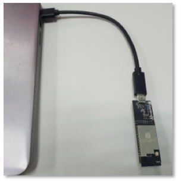

Getting started 
===============================

4.1 Connect the kit to the PC
***************************

Connect the IFW956810 Single-band Wi-Fi 4 Cloud Connectivity Manager evaluation kit to the PC using either the Type-C connector or Type-A male to Type-C female cable.

    Connect the USB dongle to the PC

4.2 Set up the host machine
************************

Run a serial terminal to communicate with the kit over USB by choosing higher of the two enumerated COM ports with the following configuration.

.. list-table::
   :widths: 25 25

   * - Baudrate:
     - 115,200
   * - Bits:
     - 8
   * - Parity:
     - None
   * - Stop: 
     - 1
   * - Flow control:
     - None
   * - Local Echo:
     - Yes
   * - End of Line:
     - Line Feed

See Section 7 for more details.

Once you open the serial terminal, type AT+CONF? About in the serial terminal. 
You should see a response “**OK Infineon IFW56810 CCM**”.

Steps in sections 4.3 to 4.5 are required only for the first time you connect. The IFW56810 module will remember its configuration and will be ready to connect to your AWS account automatically.

Jump to Section 4.6 if the kit has already been configured to connect to AWS. 

4.3	Set up your AWS account and permissions
********************************************

Follow the instructions in Amazon documentation (`Set up your AWS Account <https://docs.aws.amazon.com/iot/latest/developerguide/setting-up.html>`_) to create your account and get started.

1.	Sign up for an AWS account. 
2.	Create a user and grant permissions for access to AWS IoT resources. 
3.	Open the AWS IoT Console.

4.4	Register the kit to your AWS development account
*****************************************************

1.	Open the AWS IoT Console.
2.	Select Manage, and then select Things.  
3.	Choose Create Things. 
4.	Select Create single thing, and then click Next.
5.	In the terminal application, type the following command:  
	:: 
		AT+CONF? ThingName

6.	Copy the returned string (a sequence of alphanumeric characters) from the terminal. 
7.	On the console, on the Specify thing properties page, paste the copied string from the terminal into the Thing name field under Thing properties. 
8.	Leave other fields at their default values, and then click Next. 
9.	In the terminal application, type the following command: 
	:: 
		AT+CONF? Certificate 
		
	You will receive the device certificate in PEM format as part of the response.  

10.	Copy the returned string (a longer sequence of alphanumeric symbols), and save it into a text file on your host machine as “ThingName.cert.pem”.
	Replace ThingName with the name of the Thing obtained in Step 5. 
11.	On the Configure device certificate page, select Use my certificate, and then choose CA is not registered with AWS IoT.
12.	Under Certificate, select Choose file. 
13.	Double-click the ThingName.cert.pem file created in Step 10.
	Replace ThingName with the name of the Thing obtained in Step 5.
14.	Under Certificate Status, select Active.
15.	Click Next to attach policies to the certificate.
16.	Click Create to Create a policy. This opens a new tab. 
17.	Enter the policy name (e.g., IoTDevPolicy) and click Advanced mode. 
18.	Copy the following section into the console.
	::
		{ "Version": "2012-10-17", "Statement": [ { "Effect": "Allow", "Action": "*", "Resource": "*" } ] }

	.. note::	The examples in this document are intended only for development environments.  All devices in your end product must have credentials with privileges that authorize only intended actions on specific resources. The specific permission policies can vary for your use case. Identify the permission policies that best meet your business and security requirements.

19.	Click Create to create the policy. 
20.	Go back to the Thing creation tab, and choose the policy created in the earlier step. 
21.	Click Create Thing. 
22.	In the AWS IoT Console, choose Settings, and then copy your account Endpoint string under Device data endpoint.
23.	Type the following AT command in the serial terminal to configure the endpoint:
	:: 
		AT+CONF EndPoint=<endpoint copied in step 22 >.

.. toctree::
   :maxdepth: 2
   :hidden:
