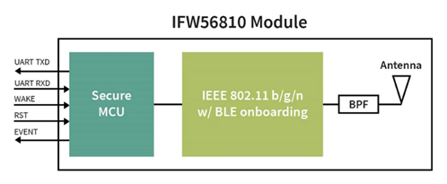

How CCM works
===============

The AIROC™ Cloud Connectivity Manager module (CCM) simplifies the steps that you follow to develop an IoT product that end users can effortlessly and securely connect to your Product Cloud. CCM modules achieve this by incorporating the following four key IoT features in a single module:

1. Industry-leading Wi-Fi communications, including SoftAP onboarding which helps your customers effortlessly connect your product to their local Wi-Fi
2. A standardized AT command set compatible with AWS IoT ExpressLink 
3. Device authentication, provisioning, and security
4. Cloud-based device monitoring

Key to the security capabilities of a CCM module is a unique X.509 device certificate that’s incorporated in every  module. This secure, unspoofable device certificate is used by the host to identify itself in the field. CCM device certificates are pre-populated in CIRRENT™ Cloud ID which means that products in the field can, when first connecting to the internet, automatically authenticate securely with your Product Cloud.

The process also automatically configures Product Cloud requirements, e.g. configuring a “Thing” in AWS IoT Core. The benefits of using a CCM module during product development and roll-out includes:

* | Building on INFINEON’s long history with wireless connectivity, including extensive experience acquired through Cypress Semiconductor. That includes access to solutions with a BLE-based or Soft AP onboarding option, which smooths out the process of joining Wi-Fi at customer sites. It removes an element of friction in getting your IoT devices onboarded and unblocks the ability to earn revenue.
  |

* | Developers can develop products that use simple AT commands such as “CONNECT” and “SEND” to connect and stream data to their Product Cloud and do so within hours, not weeks.
  |

* | Original equipment manufacturers (OEMs) can easily transform  existing products into IoT devices without the need for a deep understanding of communications and security implementation requirements, and without merging large amounts of code.
  |

* | Software that is upgradable over-the-air (OTA). Upgrades of CCM modules are possible with IFX-signed code, including support for host OTA upgrades to ensure security and future proofing.
  |

* | Support for CIRRENT™ Cloud ID, which ensures that each device has a unique device identity and is assigned to a specific Product Company. This device identity is stored in a secure hardware element to ensure a fail-proof mechanism.
  |

* | Maintaining fleet security and health at scale by providing an out-of-the-box solution that securely transmits data to and from the cloud via Wi-Fi, including online device monitoring.
  |

Hardware Description
*********************

The AIROC™ IFW56810 module, also known as the AIROC™ Cloud Connectivity Manager (CCM) module, contains an integrated antenna and provides everything needed to connect a host processor to the cloud. Pre-certified for FCC, CE, Canada, Japan, Taiwan, Australia, and New Zealand, this module requires no extra RF equipment or clocking circuitry.

With just five host interface signals plus power and ground, connection to a host using an industry-standard UART is straightforward. IEEE 802.11n single band 2.4 GHz Wi-Fi performance is based on the industry’s most widely deployed IoT technology from INFINEON®. Bluetooth® LE onboarding to Wi-Fi networks is also supported.
 

Physical characteristics
^^^^^^^^^^^^^^^^^^^^^^^^^

=======================   ====================================================
Features                  Description 
-----------------------   ----------------------------------------------------
Product description       IEEE 802.11 b/g/n wireless LAN and Bluetooth® IoT module
Host interface            UART
Dimension                 36.0mm(L) x 18mm(W) x 2.8mm(H)
Form factor               LGA module, 145p
Antenna                   Internal PCB antenna
Weight                    2.3g
=======================   ====================================================

Operating conditions
^^^^^^^^^^^^^^^^^^^^^

==================================   ===============================================================
Factor                               Description 
----------------------------------   ---------------------------------------------------------------
Voltage                              VBAT: 3.2V~4.8V (3.6V typical); VDD: 1.7V~3.6V
Operating temperature                -30°C to 85°C (optimal RF performance guarantee -30°C to 80°C)
Operating humidity                   less than 85% R.H.
Storage temperature -40°C to 90°C    -40°C to 90°C 
Storage humidity                     less than 60% R.H.
==================================   ===============================================================

Wireless features
******************

Every CCM module includes industry-leading INFINEON Wi-Fi technology for long range, robust connectivity. CCM modules support:

* Wi-Fi 4 (802.11n)
* Up to 96Mbps PHY data rate
* Integrated Antenna
* Soft AP or BLE Wi-Fi onboarding
* US, Canada, EU
* On-module flash memory to store second FW image for safe over-the-air updates

Software description
******************

* Cloud management features
* AWS IoT Express Link compatible
* Supports over-the-air updates

Networking features include:

* Full network stack offload from host: TCP/IP, TLS, DNS, HTTP, and MQTT
* Fully documented command set for simple configuration from host processor

CCM datasheet
******************

We publish a complete datasheet for the CCM module `here <https://www.infineon.com/dgdl/Infineon-AIROC%20CCM%20KIT-DataSheet-v01_00-EN.pdf?fileId=8ac78c8c80f4d329018128f3a9791d57>`_.
