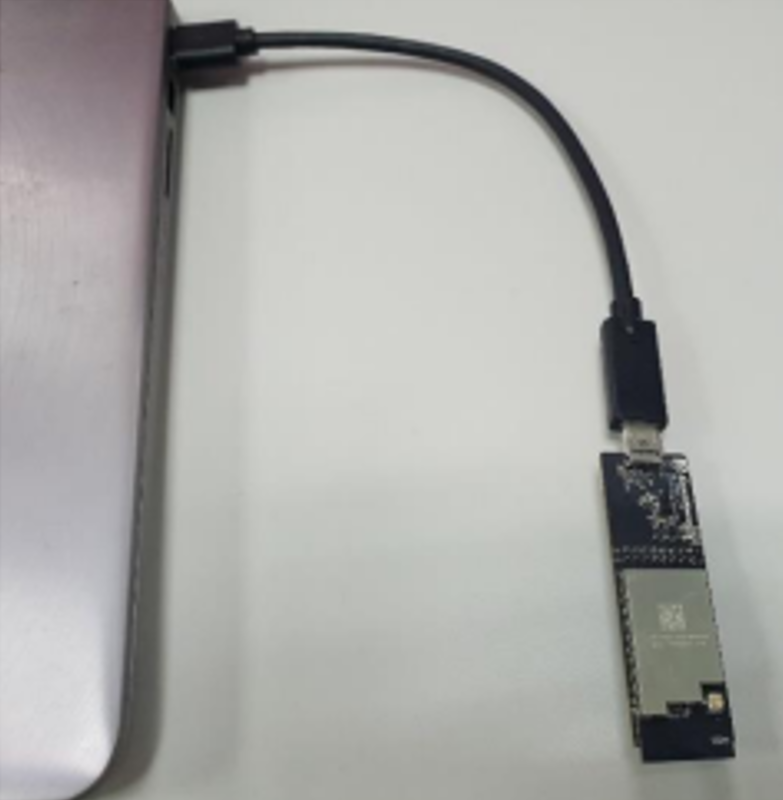
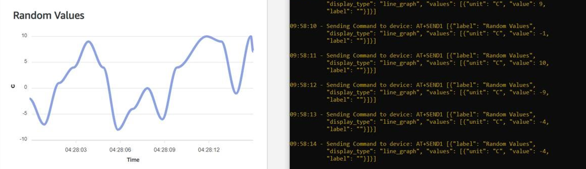

Quick evaluation flow
======================

The IFW956810 CCM evaluation kit comes with a quick evaluation flow that lets you test your device right out of the box without creating an AWS account. The following steps will enable you to connect the kit to the internet through Wi-Fi and send random data points to the AWS staging account. 

We provide an AWS Staging account that enables users who do not have an AWS account to quickly evaluate the kit. To connect programmatically to an AWS service like the AWS IoT core, you use an endpoint. An  endpoint is the entry point URL for an AWS web service. All CCM devices come with a preconfigured Endpoint of AWS staging account for evaluating the Quick connect flow. 

.. NOTE:: Quick connect is meant to evaluate the physical CCM device only, we strongly recommend that you follow the complete Getting Started Guide.
			 

**Connect the CCM module to your PC**
			 

Connect the IFW956810 Single-band Wi-Fi 4 Cloud Connectivity Manager evaluation kit to the PC using either the Type-C connector or Type-A male to Type-C female cable.

Figure 4	Connect the USB dongle to the PC

**Steps for Quick Connect evaluation**

1. Download the following quick connect pakage and extract Infineon-qc-utility.zip: https://quickconnectexpresslinkutility.s3.us-west-2.amazonaws.com/infineon/QuickConnect_infineon_v1.0.zip

2. Extract the utility package inside the Infineon-qc-utility folder with respect to your OS.

3. Connect the IFW956810 Single-band Wi-Fi 4 Cloud Connectivity Manager evaluation kit to the PC using either the Type-C connector or Type-A male to Type-C female cable and determine the serial port. To find the serial port of the device, please refer to section (ABCDEFGHI INSERT LINK HERE) 

4. Complete the details in the config.txt file to have the correct serial port, as well as Wi-Fi SSID and password.

5. Execute the executable in the quick connect package: run the Start_Quick_Connect.exe in the case of Windows OS, or in Linux and Mac, go inside the extracted folder.

6. Open the terminal and enter the following commands 

::

	chmod +x Start_Quick_Connect (for giving Executable permission)
::

	. / Start_Quick_Connect

7.   The workflow will prompt you to open the visualizer in your browser. You can either select Yes or copy and paste this link into the browser. After a few seconds, you will see random values being published from IFW956810 CCM evaluation kit on the visualizer.

  
Random values displayed in visualizer from IFW956810 CCM evaluation kit 

.. Note:: Visualizer is a GUI that displays random data points getting published to AWS staging account as a graph.