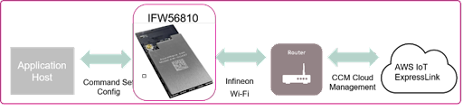

What is CCM
============

The AIROC™ Cloud Connectivity Manager (CCM) module provides a simple, secure Wi-Fi networking subsystem that allows Product Companies to develop new products that connect to their Product Cloud without extensive firmware development, testing, or maintenance. CCM modules include secure cloud-based device provisioning and authentication and cloud-based device monitoring.
With INFINEON, the leader in Wi-Fi for IoT, managing the connectivity, cloud networking, and security pieces, customers get their connected products to market faster and with reduced risk.

AIROC™ CCM modules assemble all the essential wireless, networking, cloud, and security features into a turnkey certified hardware and firmware solution.

* The hardware leverages Infineon’s recognized leadership in the security industry to pair a pre-provisioned, secure MCU with one of the IoT industry’s most reliable and widely shipped Wi-Fi chips, into a single module that you can plug into your host over a serial interface .

* Modules arrive pre-programmed with tested, signed, secure Infineon firmware eliminating the IoT learning curve and reducing development costs. Infineon’s simple command set supports AWS IoT ExpressLink and is provided for easy integration into your product.

* CCM modules natively connect to CIRRENT™ Cloud ID, part of the INFINEON product portfolio. Each CCM module is pre-populated with a device certificate that’s compatible with Cloud ID, effortlessly facilitating secure device authentication and provisioning across several cloud vendors, including AWS IoT Core. CCM modules also include detailed cloud-based device monitoring thanks to CIRRENT™ INI.

Cloud Connectivity Manager benefits speed to market in a range of IoT use cases, including:

* Industrial Automation
* Factory Automation, Industrial Robotics
* Smart Building
* HVAC, Occupancy Management
* Smart Medical / Healthcare
* Blood Pressure Monitors, Connected Patient Room Equipment
* Smart Appliance & white goods

Almost any IoT developer that is implementing a first-time Internet of Things (IoT) application can offload the complex, undifferentiated work required to securely connect devices to the cloud simply by including a CCM module in their device.