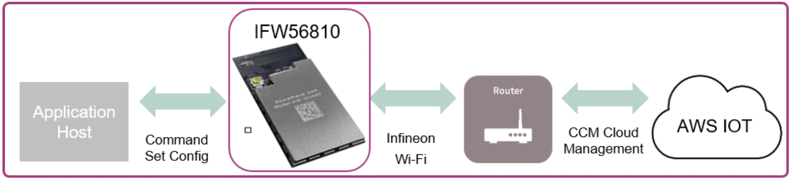

What is CCM
============

The AIROC™ Cloud Connectivity Manager (CCM) module provides a simple, secure Wi-Fi networking subsystem that easily connects to the cloud. Thanks to CCM, Product Companies can develop new products that connect to their Product Cloud without the need for extensive firmware development, testing, or maintenance. 

CCM modules enable secure cloud-based device provisioning and authentication as well as cloud-based device monitoring. With INFINEON — the leader in Wi-Fi for IoT — managing connectivity, cloud networking, and security, customers can get their connected products to market faster.

Every AIROC™ CCM module assembles all the essential wireless, networking, cloud, and security features into a certified turnkey hardware and firmware solution.

* CCM hardware leverages Infineon’s recognized leadership in the security industry to pair a pre-provisioned, secure MCU with one of the IoT industry’s most reliable and widely shipped Wi-Fi chips. The MCU and Wi-Fi capabilities ship on a single module that plugs into your host over a serial interface.

* Modules arrive pre-programmed with tested, signed, secure INFINEON firmware. This firmware minimizes the IoT learning curve and reduces development costs. Infineon’s simple command set supports AWS IoT ExpressLink and is easy to integrate into your product.

* CCM modules natively connect to CIRRENT™ Cloud ID, part of the INFINEON product portfolio. Each CCM module is pre-populated with a Cloud ID-compatible device certificate,, effortlessly facilitating secure device authentication and provisioning across several cloud vendors, including AWS IoT Core. CCM modules also include detailed cloud-based device monitoring thanks to CIRRENT™ INI.

Incorporating a CCM module in a Product improves speed to market in a range of IoT use cases, including:

* Industrial and factory automation
* Robotics
* Smart buildings, HVAC and occupancy management
* Healthcare, including connected patient room equipment
* Smart appliances and white goods

Almost any IoT developer that is implementing a first-time Internet of Things (IoT) application can offload the complex, undifferentiated work required to securely connect devices to the cloud simply by including a CCM module in their device.
